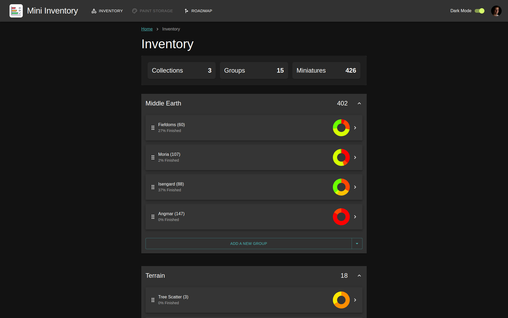

# Miniature Inventory <!-- omit in toc -->

## Description

Welcome to the Miniature Inventory project. This is a management tool which allows it's users to input their collection
of miniatures (be it Warhammer, DnD or anything else) and keep track of their painting progress. The application is uses
a [React (vitejs-react) frontend](https://v2.vitejs.dev/) and
a [Slim4 PHP backend](https://www.slimframework.com/docs/v4/) (due to server restraints).


*Inventory page inside the application*

## Table of contents

* [Feature Highlights:](#feature-highlights)
* [Using the application](#using-the-application)
* [Contributing](#contributing)
  * [Instructions](#instructions)
* [Running the project locally](#running-the-project-locally)
  * [The API & Database](#the-api--database)
    * [API Client (Postman)](#api-client-postman)

## Feature Highlights:

- Creating a custom (painting) workflow that fits you best
- Organizing your collection of miniatures in 3 levels; *Collections > Groups > Models*
- Graphs on your overall progress & progress per group
- Saving a list of all the paints you own with easy dropdowns for common brands
    - Currently supporting only Citadel
- Authenticate via Firebase Auth, allowing email/password & Google sign in.

## Using the application

You can use the application on [miniature-inventory.nl/](https://miniature-inventory.nl/). Start by logging in with
Google or by creating an account using the sign-up page. After logging in head to
the [settings page](https://miniature-inventory.nl/settings) (link under profile icon in the top right) and set up your
custom workflow.

With workflow all set up you can start creating collections, groups, miniatures.

## Contributing

We welcome any and all contributions! Here are some ways you can get started:

1. **Report bugs**: If you encounter any bugs, please let us know. Open up an issue and let us know the problem.
2. **Contribute code**: If you are a developer and want to contribute, follow the instructions below to get started!
3. **Suggestions**: If you don't want to code but have some awesome ideas, open up an issue explaining some updates or
   imporvements you would like to see!
4. **Documentation**: If you see the need for some additional documentation, feel free to add some!

### Instructions

1. Fork this repository
2. Clone the forked repository
3. Add your contributions (code or documentation)
4. Commit and push
5. Submit a pull request
6. Wait for pull request to be merged

## Running the project locally

The application is build up into 3 main parts; The webapp, an API and a database. Each of these component can be run
locally which allows you to make some changes and test these before commiting / submitting a pull request.

### The API & Database

The API and database can be started locally using [Docker](https://www.docker.com/). There is a Dockerfile inside
the /api folder which can be used to create an image containing the required environment to run the Slim4 API. Since the
API is connecting to a database and a connection is required between its easier to spin everything up using
docker compose.

```shell
# from the root directory:
docker compose up
```

> Note: Running the api container automatically creates/overwrites your .env file with the local database credentials.

#### API Client (Postman)

After the containers are started you can open up an API client like [Postman](https://www.postman.com/)
or [Thunder Client](https://www.thunderclient.com/). There is a postman collection in the repository you can
use if you decide on using Postman.

> Note: Each request must have an Authorization header consisting a bearer token. For development, it's not necessary to
> have a valid token (as its being mocked in the [$tokenMiddleware](./api/src/middleware/token-verification.php#L34)).